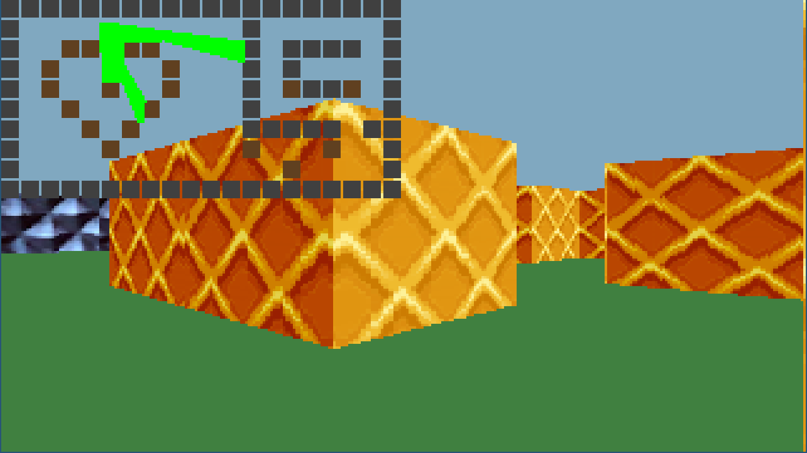

 raycaster
============




Hinweise:
=========

- benötigt Python und Pygame
- Steuerung mit WASD (vorwärts, rückwärts, seitwärts laufen), SHIFT (sprinten) und Maus (drehen)
- mit F9 können Wände an- und ausgeschaltet werden
- mit F10 können die Bodentexturen an- und ausgeschaltet werden
- mit F11 können die Wandtexturen an- und ausgeschaltet werden
- mit F12 kann die Minimap (die zudem auch das Raycasting visualisiert) ein- und ausgeblendet werden
- mit ESCAPE kann das Spiel beendet werden:
    - beim ersten Druck auf ESCAPE wird der Mauszeiger vom Fenster freigegeben; durch einen Klick ins Fenster wird die Maus wieder vom Fenster "gecaptured" und man kann weiterpsielen
    - beim zweiten Druck auf ESCAPE wird das Spiel schließlich beendet
    
- das Rendern des Bodens kann mithilfe von Cython beschleunigt werden, hierfür muss der folgende Befehl ausgeführt werden:

```pip3 install -e .```

Was ist Raycasting:
===================

> In der Computerspielentwicklung bezeichnet der Begriff Raycasting das auf einer zweidimensionalen Karte basierte Berechnen einer Pseudo-3D-Ansicht. Auf Basis der Entfernung zu einem Objekt, den ein „Sichtstrahl“ trifft, wird zum einen die Objektfarbe vertikal zentriert dargestellt und zum anderen der Anteil an Decke oder Boden der entsprechenden Pixel-Spalte berechnet. Im Gegensatz zur normalen Raytracing-Technik wird hier nur eine einzelne Bildzeile abgetastet, um das gesamte Bild zu berechnen; die Verdeckungsberechnung findet also nur in einer Ebene und nicht im Raum statt. Diese Art des Raycasting findet zum Beispiel im Computerspiel Wolfenstein 3D Anwendung.
Entsprechend der oberen Grafik wird die Bildpunktfarbe festgestellt (oberer „Streifen“) und entsprechend der Entfernung wird ein vertikaler Bereich in dieser Farbe gezeichnet. Alle übrigen Bereiche sind Himmel bzw. Decke oder Boden.
>

>Da diese Technik keinem echten 3D entspricht, unterliegt sie diversen Einschränkungen: Es können keine dreidimensionalen Objekte wie Personen und Gegenstände dargestellt werden, Boden und Decke sind immer gleich hoch und Schrägen sind nicht möglich. 
> *(aus der [Wikipedia](https://de.wikipedia.org/wiki/Raycasting))*
